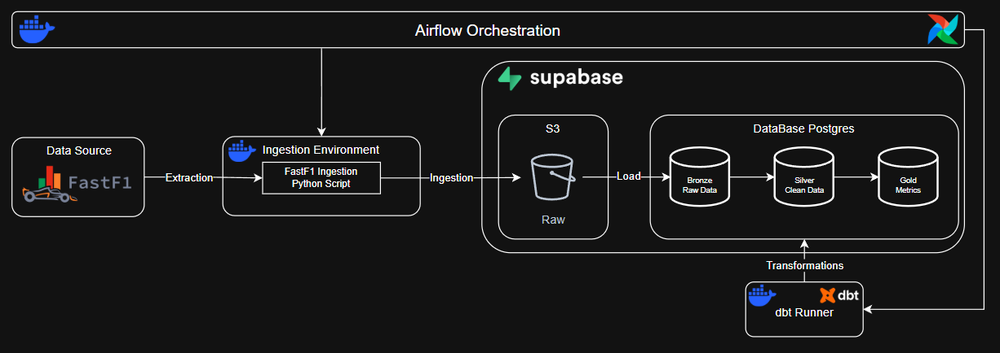
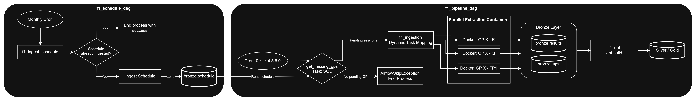

# 🏛️ Detalhes da Arquitetura & Decisões de Engenharia

Este documento descreve os componentes técnicos, padrões de engenharia e decisões de design adotadas no **Formula 1 Data Pipeline**.

---

## 🎯 1. Visão Geral

O projeto segue a abordagem **ELT (Extract, Load, Transform)** estruturada em três pilares principais:

- **Extração e Carga**: Ingestão via Python/FastF1 persistindo os dados brutos no Supabase (S3 e PostgreSQL).
- **Transformação**: Modelagem dimensional e testes de qualidade de dados centralizados no dbt.
- **Orquestração**: Agendamento incremental e paralelismo gerenciados pelo Apache Airflow.



---

## 🏗️ 2. Componentes & Decisões Técnicas

### 2.1 Ingestão & Extração (Python + FastF1)
- **Biblioteca FastF1**: Extração de resultados, telemetria, tempos de volta e calendário oficial da temporada.
- **Buffer em Memória (`io.BytesIO`)**: Os dados extraídos são convertidos para Parquet diretamente na memória antes do upload para o S3, evitando criação de arquivos temporários em disco nos containers.
- **Cache Local (`fastf1_cache`)**: Volume Docker nomeado para reaproveitar os downloads da API da F1 entre execuções, poupando banda e acelerando testes locais.

### 2.2 Armazenamento Raw (Supabase Storage / S3)
- **Protocolo S3**: Utilização do Supabase Storage via `boto3`.
- **Formato Parquet**: Compactação colunar (Snappy) mantendo a tipagem original da extração.
- **Estrutura de Chaves**:
  ```text
  f1-lake/
  ├── schedule/{year}.parquet
  ├── results/{year}/{gp}/{session}.parquet
  └── laps/{year}/{gp}/{session}.parquet
  ```
- **Persistência e Cold Storage**: Embora o script de ingestão grave simultaneamente no Postgres e no S3 (*dual-write*), manter os arquivos `.parquet` particionados garante uma cópia bruta imutável sob sua custódia caso seja necessário auditar ou recriar o banco de dados.

### 2.3 Banco de Dados & Camada Relacional (PostgreSQL no Supabase)
- **PostgreSQL 16**: Atua como Data Warehouse para as tabelas das camadas `bronze`, `silver`, `gold` e serve as views analíticas para a camada `website`. Para o volume de dados do projeto, um banco relacional bem indexado atende perfeitamente com baixo custo e baixa latência.
- **Connection Pooler (porta 5432)**: Gerencia o pool de conexões para suportar acessos simultâneos do Airflow, scripts de carga e do dashboard Next.js.
- **Divisão de Esquemas**:
  - `bronze`: Tabelas brutas populadas pelos scripts de carga (`schedule`, `results`, `laps`).
  - `silver`: Tabelas limpas, tipadas e padronizadas (`stg_schedule`, `stg_results`, `stg_laps`).
  - `gold`: Modelo dimensional Snowflake com fatos, dimensões e chaves substitutas (`circuit_sk`, `session_sk`, etc.).
  - `website`: Views analíticas consumidas pelo dashboard.

### 2.4 Camada de Transformação (dbt)
- **Modelagem Declarativa**: Centralização das regras de negócio e métricas no dbt.
- **Sanitização de Dados**: Macros customizadas para tratar sentinelas de tempo do Pandas (`NaT`, `-9223372036854775808`) e valores nulos de texto (`'nan'`, `'None'`).
- **Qualidade de Dados**: Testes de integridade (`not_null`, `unique`, `relationships`) executados durante o `dbt build`.

---

## ⚡ 3. Orquestração (Apache Airflow 3)

A orquestração separa processos de cadências distintas em DAGs dedicadas, evitando desperdício computacional:



### 3.1 Separação de Cadências
- **`f1_schedule_dag` (`@monthly`)**:
  - Dados de baixa frequência (calendário da temporada) são isolados nesta DAG.
  - Suporta execução automática mensal ou manual via parâmetro (`params.year`), permitindo carregar o cronograma de qualquer temporada sob demanda.
- **`f1_pipeline_dag` (`0 * * * 4,5,6,0`)**:
  - Dados de alta frequência (resultados de treinos, classificações e corridas) rodam a cada hora nos fins de semana de corrida.
  - Como o calendário já reside em `bronze.schedule`, a verificação de sessões pendentes executa em milissegundos via SQL, encerrando com `AirflowSkipException` sem instanciar containers Docker desnecessários quando não há eventos.

### 3.2 Detecção Incremental de Sessões (`get_missing_gps.sql`)
- Desmembra as sessões da temporada (`CROSS JOIN LATERAL`) e filtra aquelas ocorridas há pelo menos **3 horas** (`session_date <= CURRENT_TIMESTAMP - INTERVAL '3 hour'`), garantindo que os dados já foram consolidados pela FIA/FastF1.
- Cruza com o que já foi ingerido na camada `bronze`. Apenas sessões pendentes são enviadas para extração.

### 3.3 Dynamic Task Mapping
- O Airflow expande dinamicamente uma tarefa para cada sessão pendente (`DockerOperator.partial().expand()`).
- Se uma sessão falhar por oscilação momentânea da API, apenas aquela tarefa entra em retry (`retries=3`), sem reiniciar todo o lote.

### 3.4 Gatilho de Transformação (`f1_dbt`)
- Após a conclusão bem-sucedida de todas as tarefas de extração da rodada, a DAG aciona a tarefa `f1_dbt` executando `dbt build`.
- Isso processa as camadas Silver e Gold, valida os testes de qualidade de dados e atualiza as views da camada `website` de ponta a ponta.

### 3.5 Isolamento via Docker Socket (`/var/run/docker.sock`)
- O Airflow dispara a ingestão e o dbt como containers Docker separados (`f1-pipeline-ingestion:latest` e `f1-pipeline-dbt:latest`), garantindo isolamento total de dependências em relação ao ambiente do Airflow.

---

## 🛡️ 4. Idempotência e Reprocessamento

- **Deleção Prévia**: O método `delete_session` no `PostgresLoader` limpa dados existentes daquela sessão antes da inserção na camada Bronze:
  ```sql
  DELETE FROM bronze.results WHERE year = :year AND gp = :gp AND session = :session;
  ```
- **DAG Manual (`f1_manual_pipeline_dag.py`)**: Interface com parâmetros no Airflow para reprocessar anos, intervalos de GPs ou sessões específicas, com opção de flag `force` para sobrescrever o S3 e o banco.
- **Materialização dbt**: Modelos estruturados como `table` ou `view`, garantindo que qualquer nova carga reflita imediatamente nas camadas finais.

---

## 🔗 Links Úteis

- [🚀 Guia de Setup e Execução Local](./setup.md)
- [📊 Modelagem de Dados & Esquema Snowflake](./data_modeling.md)
- [📖 README Principal](../README.md)
