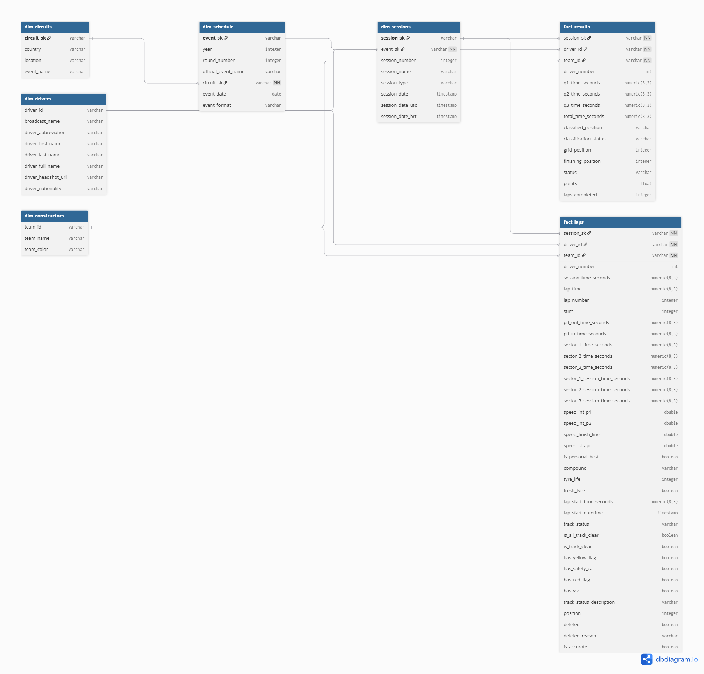

# 📊 Modelagem de Dados — Arquitetura Medalhão & Marts

Este documento descreve a arquitetura de dados, a modelagem dimensional (*Snowflake Schema*) e a camada analítica de serviço (*Website Marts*) implementada via **dbt** e **PostgreSQL (Supabase)** no **F1 Data Pipeline**.

---

## 🏛️ 1. Visão Geral da Arquitetura Medalhão

O pipeline estrutura os dados brutos extraídos dos resultados, da telemetria e das cronometragens da Fórmula 1 em camadas progressivas de qualidade, tipagem e enriquecimento:

```text
┌─────────────────┐       ┌─────────────────┐       ┌─────────────────┐       ┌─────────────────┐
│     BRONZE      │       │     SILVER      │       │      GOLD       │       │  WEBSITE MARTS  │
│ (Raw / Parquet) │  ───> │    (Staging)    │  ───> │   (Snowflake)   │  ───> │ (Serving Layer) │
│ S3 Lake/Tabelas │       │  dbt Staging /  │       │ Fatos & Dims /  │       │ Views e Tabelas │
│ Sem Tratamento  │       │ Limpeza & Tipos │       │ Surrogate Keys  │       │   Analíticas    │
└─────────────────┘       └─────────────────┘       └─────────────────┘       └─────────────────┘
```

| Camada | Schema | Materialização | Descrição |
| :--- | :--- | :--- | :--- |
| **Bronze** | `bronze` | Tabela / S3 Parquet | Dados brutos ingeridos diretamente do FastF1 em formato colunar Parquet e espelhados em tabelas raw. |
| **Silver** | `silver` | View / Staging | Limpeza, renomeação de colunas padronizadas, conversão de tipos de dados e desaninhamento de sessões. |
| **Gold** | `gold` | Tabela | Modelo dimensional Snowflake com tabelas de fatos e dimensões normalizadas, indexadas para alta performance analítica. |
| **Website**| `website` | View / Tabela | Modelos analíticos finais com regras de negócio, agregações cumulativas e métricas para o Dashboard. |

---

## ❄️ 2. Modelo Dimensional (Snowflake Schema)

A camada **Gold** implementa um esquema floco de neve (*Snowflake Schema*). Esse padrão foi escolhido para normalizar a hierarquia espacial e temporal dos finais de semana de Grande Prêmio, eliminando redundâncias de circuitos e calendários em cada sessão de pista:




---

## 🗄️ 3. Dicionário das Camadas

### 3.1 Camada Silver (Staging)

A camada Silver padroniza, limpa e enriquece os dados brutos da Bronze, garantindo tipagem consistente e tratando anomalias nos dados da Fórmula 1.

#### 🧹 Padrões Transversais de Sanitização (Macros dbt)
A extração via Python/Pandas a partir da biblioteca FastF1 gera artefatos clássicos de serialização que comprometeriam agregações e funções analíticas se não fossem tratados. Para assegurar qualidade e consistência em toda a camada Silver, foram implementadas macros modulares e reutilizáveis:
- **`clean_null_string`**: Converte strings vazias (`''`) e artefatos de texto gerados na exportação (`'nan'`, `'None'`, `'None None'`) em valores `NULL` reais do SQL.
- **`clean_null_time`**: Trata o valor sentinela `-9223372036854775808` (representação mínima de int64 para `pd.NaT` no Pandas) e tempos $\le 0$, convertendo-os em `NULL`.

#### 🏎️ `stg_results`
* **Origem**: `bronze.results` + Seed `driver_overrides`
* **Granularidade**: Um registro por piloto por sessão (Treino, Quali, Sprint ou Corrida).
* **Transformações e Regras de Negócio**:
  - **Tratamento de Overrides**: Cruzamento com o seed manual `driver_overrides` para corrigir divergências pontuais de nomes e IDs de pilotos.
  - **Normalização Textual**: Remoção de acentos e caracteres especiais (`TRANSLATE`) para buscas e agregações confiáveis.
  - **Resolução de IDs Nulos**: Inferência de `driver_id` e `team_id` ausentes através de Window Functions (`FIRST_VALUE`) particionadas pelo nome normalizado e ordenadas pelas temporadas mais recentes.
  - **Propagação de Metadados Recentes**: Padronização de fotos oficiais (`driver_headshot_url`), cores das equipes e nomes de transmissão para a versão mais recente cadastrada, mantendo consistência no histórico.
  - **Mapeamento de Status de Classificação**: Adição da coluna `classification_status`, que traduz os códigos da posição final (como 'R', 'D', 'W') para o seu significado descritivo (ex: 'Retired', 'Disqualified').
  - **Conversão de Tempos**: Conversão de tempos de qualificação e totais de nanossegundos para segundos decimais com 3 casas (`ROUND(time / 1e9, 3)`).

#### 📅 `stg_schedule`
* **Origem**: `bronze.schedule` + Seed `circuit_overrides`
* **Granularidade**: Um registro por evento/rodada de Grande Prêmio.
* **Transformações e Regras de Negócio**:
  - **Padronização Canônica de Circuitos**: Harmonização de nomes de países e cidades inconsistentes via seed `circuit_overrides`.
  - **Limpeza de Nomes Oficiais**: Remoção do ano no sufixo do nome do evento via Regex (`REGEXP_REPLACE`).
  - **Tratamento de Fuso Horário**: Conversão de datas e horas UTC para o horário de Brasília (`session_date_brt`) usando `AT TIME ZONE 'America/Sao_Paulo'`.

#### ⏱️ `stg_laps`
* **Origem**: `bronze.laps`
* **Granularidade**: Um registro por volta completada por piloto.
* **Transformações e Regras de Negócio**:
  - **Decodificação de Status de Pista**: Quebra da coluna composta `TrackStatus` em flags booleanas analíticas (`has_yellow_flag`, `has_safety_car`, `has_vsc`, `has_red_flag`, `is_track_clear`).
  - **Conversão de Telemetria e Velocidades**: Tipagem de microssetores, tempos de parada nos boxes (`pit_in_time_seconds`, `pit_out_time_seconds`) e velocidades no radar (*Speed Trap*).

---

### 3.2 Camada Gold (Core - Modelo Snowflake)

A camada Gold implementa o modelo dimensional normalizado (*Snowflake Schema*), isolando entidades e gerando chaves substitutas (*surrogate keys*) determinísticas via hash MD5:

#### 🏛️ Dimensões
- **`dim_circuits`**: Entidade física do circuito com localização, país e nome do evento (`circuit_sk` gerado via hash MD5).
- **`dim_schedule`**: Calendário oficial de cada ano, contendo data oficial e formato do final de semana (`event_sk` gerado via hash MD5).
- **`dim_sessions`**: Normalização das 5 sessões de pista do GP (TL1, TL2, TL3, Quali, Sprint e Corrida) com chaves `session_sk` e relacionamento com `dim_schedule`.
- **`dim_drivers`**: Entidade de pilotos desduplicada, com identificador único `driver_id`, nomes completos, abreviação, nacionalidade e foto oficial.
- **`dim_constructors`**: Entidade de equipes desduplicada, com `team_id`, nome oficial e cor institucional em código hexadecimal.

#### 📈 Tabelas de Fatos
- **`fact_results`**:
  * **Granularidade**: Uma linha por piloto por sessão oficial.
  * **Métricas**: Posição final (`finishing_position`), grid de largada (`grid_position`), pontos conquistados, status de prova (Terminou, DNF, DSQ), voltas completadas e tempos de qualificação (Q1, Q2, Q3).
- **`fact_laps`**:
  * **Granularidade**: Uma linha por volta percorrida por piloto em cada sessão.
  * **Métricas & Telemetria**: Tempo de volta (`lap_time_seconds`), tempos dos setores 1, 2 e 3, velocidade máxima no radar (`speed_trap`), vida útil do pneu (`tyre_life`), composto (`compound`), stint de pit stop e indicadores de bandeira.

---

## 🌐 4. Camada de Consumo (Website Marts)

Os modelos em `transform/f1_dbt/models/marts/website` são otimizados especificamente para atender as páginas do Dashboard:

| Modelo | Tipo | Página de Consumo | Objetivo / Métricas |
| :--- | :--- | :--- | :--- |
| **`v_sessions_summary`** | Table | Visão Geral (`/`) & Corrida (`/race`) | Classificação da sessão com *gap* para o líder, *interval* para o carro à frente, deltas de posição e número de paradas. |
| **`v_driver_standings`** | View | Temporada (`/season`) | Classificação do mundial de pilotos com total de pontos, vitórias em GP/Sprint e pódios. |
| **`v_constructor_standings`** | View | Temporada (`/season`) | Classificação do mundial de construtores com pontos totais e vitórias acumuladas. |
| **`v_cumulative_drivers_points`** | View | Temporada (`/season`) | Pontuação acumulada corrida a corrida por piloto para alimentar o gráfico de linhas e o filtro de rodadas. |
| **`v_cumulative_teams_points`** | View | Temporada (`/season`) | Pontuação acumulada corrida a corrida por construtor para evolução no campeonato. |
| **`v_ideal_lap`** | View | Telemetria (`/telemetry`) | Volta ideal (soma dos melhores micro-setores) vs. melhor volta real de cada piloto. |
| **`v_lap_by_lap`** | View | Corrida (`/race`) | Evolução de ritmo volta a volta por piloto. |
| **`v_race_pace`** | View | Corrida (`/race`) | Média e desvio padrão de ritmo de corrida por piloto/equipe sem voltas anômalas (Safety Car / Outlaps). |
| **`v_tyre_strategy`** | View | Corrida (`/race`) | Duração e degradação por composto (Soft, Medium, Hard, Intermediate, Wet). |
| **`v_max_speed`** | View | Telemetria (`/telemetry`) | Velocidades máximas registradas no radar (*Speed Trap*). |

---

## 🧮 5. Regras de Negócio & Window Functions

As views analíticas utilizam Window Functions avançadas particionadas por sessão (`session_sk`):

### 5.1 Gap para o Líder e Intervalo entre Carros (`v_sessions_summary`)
```sql
-- Diferença para o líder da corrida (P1)
final_session_time_seconds - FIRST_VALUE(final_session_time_seconds) OVER (
    PARTITION BY session_sk ORDER BY finishing_position ASC NULLS LAST
) AS gap_seconds,

-- Intervalo para o carro imediatamente à frente (P - 1)
ABS(final_session_time_seconds - LAG(final_session_time_seconds, 1) OVER (
    PARTITION BY session_sk ORDER BY finishing_position ASC NULLS LAST
)) AS interval_seconds
```

### 5.2 Delta de Posição de Largada vs. Chegada
```sql
-- Posição ganha ou perdida na pista (valor positivo = escalou o grid)
grid_position - finishing_position AS delta_position
```

### 5.3 Número de Pit Stops
```sql
-- Calculado pelo número máximo de stints do piloto menos um
MAX(stint) OVER(PARTITION BY session_sk, driver_id) - 1 AS stops
```

### 5.4 Pontuação Cumulativa ao Longo da Temporada
```sql
-- Soma acumulada corrida a corrida por ano e piloto
SUM(points) OVER (
    PARTITION BY year, driver_id 
    ORDER BY round_number, session_number
    ROWS BETWEEN UNBOUNDED PRECEDING AND CURRENT ROW
) AS cumulative_driver_points
```

---

## ⚡ 6. Otimizações de Performance & Indexação

Para garantir tempos de resposta de consulta inferiores a **200 ms** no dashboard, os modelos de fatos e a tabela `v_sessions_summary` possuem índices B-Tree específicos criados via `post_hook` no dbt:

```sql
-- Índices na tabela v_sessions_summary
CREATE INDEX IF NOT EXISTS idx_sess_sum_lookup ON website.v_sessions_summary (year, round_number, session_name);
CREATE INDEX IF NOT EXISTS idx_sess_sum_finish ON website.v_sessions_summary (finishing_position);

-- Índices nas tabelas de fatos (Gold)
CREATE INDEX IF NOT EXISTS idx_fact_results_session_sk ON gold.fact_results (session_sk);
CREATE INDEX IF NOT EXISTS idx_fact_laps_session_sk ON gold.fact_laps (session_sk);
CREATE INDEX IF NOT EXISTS idx_fact_laps_session_lap_time ON gold.fact_laps (session_sk, lap_time_seconds) WHERE lap_time_seconds IS NOT NULL;
CREATE INDEX IF NOT EXISTS idx_fact_laps_speed_trap ON gold.fact_laps (session_sk, speed_trap) WHERE speed_trap IS NOT NULL;
```

---

## 🧪 7. Qualidade de Dados & Testes dbt

Os dados são auditados automaticamente na execução do dbt por meio das suítes de testes definidas nos arquivos de esquema:
- [`staging/_staging_models.yml`](../transform/f1_dbt/models/staging/_staging_models.yml): Testes de validação da camada Silver / Staging.
- [`marts/core/_core_models.yml`](../transform/f1_dbt/models/marts/core/_core_models.yml): Testes de unicidade e integridade referencial do modelo dimensional Snowflake.
- [`marts/website/_website_models.yml`](../transform/f1_dbt/models/marts/website/_website_models.yml): Testes e documentação das 10 visões analíticas de consumo do dashboard.

### Tipos de Testes Aplicados:
- **Unicidade (`unique`)**: Garante ausência de duplicação em chaves primárias e substitutas (`session_sk`, `driver_id`, `event_sk`, `team_sk`).
- **Valores Obrigatórios (`not_null`)**: Assegura preenchimento de campos críticos de pontuação, nomes, identificadores e métricas de volta.
- **Integridade Referencial (`relationships`)**: Valida que toda chave estrangeira nas tabelas de fatos existe na respectiva dimensão (`dim_sessions`, `dim_drivers`, `dim_constructors`).
- **Testes de Aceitação Customizados**: Validações de limites e regras de negócio (ex: consistência de intervalos de tempo e posições).
